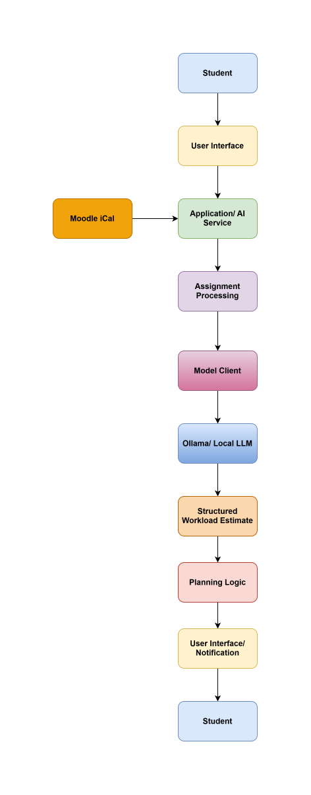

# AI Study Path and Career Assistant

Starter project for the **Development of AI Applications** course final group project.

## Team members

- Member 1 Dmytro Krempovskyy (amk1002944@student.hamk.fi)
- Member 2: Vindya Nukulasooriya (amk1001863@student.hamk.fi)
- Member 3: Lien Pham (amk1002343@student.hamk.fi)
- Member 4: Dan Le (dan23001@student.hamk.fi)

## Problem

### Intended users

University students who:
1. Manage coursework, assignments, and deadlines through Moodle.
2. Support students in planning their longer-term study and career paths

### Problem statement

Students can see when assignments are due, but it can be difficult to decide when they should start working on them.

Different assignments require different amounts of time and effort. Starting too late can lead to rushed work and missed deadlines.

The problem is not only remembering tasks, but also understanding what to do next and how current study activities connect to longer-term academic and career goals. Our project aims to develop an AI-powered student assistant that can support students across different stages of their study path:
* Managing and understanding homework, individual assignments and group projects.
* Organizing academic priorities and deadlines.
* Generating thesis topic suggestions based on the student's major, interest, and skills.
* Connecting study experience with possible career directions.
* Supporting internship and job-market exploration

The project therefore moves from a simple task-management assistant toward a more comprehensive study-to-career support system.

### Why AI is appropriate

Assignment descriptions contain unstructured natural language and can vary significantly between courses.

An LLM can interpret the assignment description, identify the type and complexity of the task, and produce an estimated workload.

Traditional fixed rules would have difficulty handling the different ways assignments are described.

Furthermore, students have not yet defined a graduation thesis topic that aligns with their skills, interests and field of study. For example, a student may ask: "I study Computer Applications and I am interested in Python, SQL and AI. What thesis topics could fit my interest?"

These tasks require understanding context, identifying relationships between information, and generating personalized suggestions.

In this scenario, LLM is useful for generating personalized suggestions connecting student's interest, strength and study goals.

In terms of further career goals, it can generate some research about job market, internship opportunities that helps student have insight about market demand.

AI therefore adds a reasoning and personalization layer on top of traditional student-management functionality.

## Solution

The AI Study Deadline Assistant helps students plan when to start their assignments.

The application reads assignment information, uses an AI model to estimate the workload, and calculates a recommended starting time before the deadline.

Example:

Assignment description  
- AI workload estimate  
- Recommended start date  
- Student reminder

The solution can be viewed as three connected levels:
1. Study management including: understanding assignments, organize homework and deadlines, identify priorities and make reminder.
2. Thesis and study planning: based on study major, skills, interests and previous academic activities to suggest possible thesis areas, thesis topic ideas, research direction, technologies or skills that may be relevant.
3. Career exploration: as a future extension, the assistant can connect the student's profile with current job-market information to support internship research, career development planning.

## Main user workflow

1. **Get assignment:** The application receives assignment information and its deadline.
2. **Process assignment:** The service layer validates and prepares the assignment description.
3. **AI analysis:** The local LLM analyses the assignment and returns a structured workload estimate.
4. **Planning:** The application calculates a recommended start time using the estimate, deadline, and a safety buffer.
5. **User output:** The student sees the assignment, estimated workload, and recommended start time.
6. **Study-profile connection:** The system compares the skills and topics identified from assignment with student's study profile, interests, previous projects.
7. **Thesis topic generation:** Based on the accumulated study information, the AI suggests possible thesis areas or topics that are related to the student's major, skills and completed assignments.
8. **Career and thesis output:** student receives a connected set of recommendations showing how current assignments can contribute to longer-term goals, for example: Assignment → Skills → Thesis idea → Career skills → Seeking for internship/Workplacement.
9. **User reaction:** student can accept, reject, or refine the suggestions, allowing the AI to generate more relevant thesis and internship recommendations.

## Architecture

Initial architecture:

> **Core Architectural Rule:** The user interface does not communicate directly with the model or Ollama. Model interaction passes through the application/service layer.

## Model

- **Model used:** Qwen3 4B (`qwen3:4b`)
- **Selection rationale:** Qwen3 4B is a relatively lightweight model that can run locally through Ollama. It supports instruction following and structured AI tasks, making it suitable for analysing assignment descriptions and producing workload estimates. The model will be evaluated during development and may be changed if another local model performs better.

## Additional AI capability

Possible capability:

- [ ] Tools / External integration (planned: Moodle iCal)
- [ ] Memory / Persistent state (possible later extension)
- [ ] Other capabilities if justified later

### Capability justification

The application may integrate with a student's Moodle calendar/iCal feed to obtain assignment information automatically.

This allows the AI component to analyse real assignment descriptions instead of requiring the student to manually copy every assignment into the application.

The important value of AI is therefore not simply generating text, but connecting different types of student information and turning them into personalized suggestions.

## Setup

Setup instructions will be updated as the application is developed.

The project is expected to use:

- Python
- Ollama
- Local LLM
- Pydantic
- Telegram bot for notifications and as an interface
- Moodle iCal integration (planned)
- Required Python dependencies listed in requirements.txt

## Evaluation

We will test the application using representative assignment descriptions with different workload levels, study backgrounds, interests, and career goals.

Evaluation can check:

- whether the assignment is interpreted correctly;
- whether the workload estimate is reasonable;
- whether structured output is valid;
- whether the recommended start time is calculated correctly;
- whether the application handles incomplete or unclear assignment information safely.
- whether the generated thesis topics are relevant to the student's major, skills, interests, and previous study activities.
- whether the system can create a logical connection between current assignments, skills, thesis development, and career preparation.
- whether the application handles incomplete, ambiguous, or insufficient student information safely and avoids presenting uncertain suggestions as facts.
- whether repeated interactions with additional student information improve the relevance of the generated recommendations.

## Known limitations

- AI workload estimates may be inaccurate.
- Assignment descriptions may not contain enough information for a reliable estimate.
- Actual working time differs between students.
- Moodle/iCal data availability may vary.
- Recommended start times should be treated as planning assistance rather than guaranteed estimates.
- Thesis topic suggestions are currently based mainly on the information provided by the student and the LLM's existing knowledge. They do not necessarily represent the current job market.
- The current system does not automatically verify whether suggested thesis topics or career opportunities are available or relevant at a specific university, company, or location.
- AI-generated recommendations should be treated as decision-support and planning assistance rather than guaranteed workload estimates, thesis recommendations, or career outcomes.

## Future improvements

Possible future extensions:

- Student feedback after completing an assignment
- Persistent storage of actual completion times
- Personalized workload estimates
- Natural-language commands such as "What's due this week?"
- Snoozing or rescheduling reminders
- Build a persistent student profile containing courses, skills, interests, projects, thesis preferences, and career goals.
- Improve personalization by comparing assignments and acquired skills over time.
- Add RAG to retrieve information from trusted academic, university, and career sources.
- Integrate current job-market data or job-search APIs to support internship and job exploration.
- Add stronger privacy and security mechanisms for storing and processing student information.
